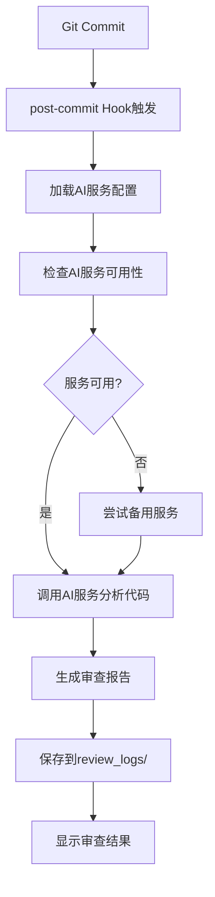
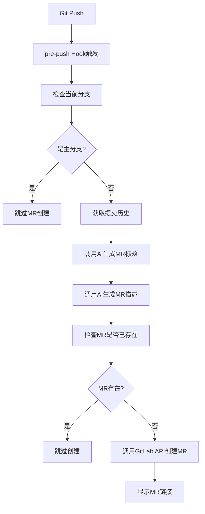

# CodeRocket 架构概览

## 📋 项目概述

CodeRocket 是一个基于多种 AI 服务的智能 Git 提交代码审查工具，通过 Git Hook 自动对每次提交进行全面的代码质量分析和审查，支持 GitLab MR 自动创建。

## 🏗️ 系统架构

### 分层架构设计

```
┌─────────────────────────────────────────────────────────────┐
│                    应用层 (Git Hooks)                        │
│  ┌─────────────────────┐    ┌─────────────────────────────┐  │
│  │   post-commit       │    │      pre-push               │  │
│  │   (代码审查)         │    │   (MR自动创建)              │  │
│  └─────────────────────┘    └─────────────────────────────┘  │
└─────────────────────────────────────────────────────────────┘
                              │
┌─────────────────────────────────────────────────────────────┐
│                  抽象层 (AI Service Manager)                 │
│  ┌─────────────────────────────────────────────────────────┐ │
│  │           ai-service-manager.sh                         │ │
│  │  • 统一AI服务接口                                        │ │
│  │  • 智能服务选择                                          │ │
│  │  • 错误处理和重试                                        │ │
│  └─────────────────────────────────────────────────────────┘ │
└─────────────────────────────────────────────────────────────┘
                              │
┌─────────────────────────────────────────────────────────────┐
│                    服务层 (AI Services)                      │
│  ┌─────────────┐  ┌─────────────┐  ┌─────────────────────┐  │
│  │   Gemini    │  │  OpenCode   │  │    ClaudeCode       │  │
│  │   Service   │  │   Service   │  │     Service         │  │
│  └─────────────┘  └─────────────┘  └─────────────────────┘  │
└─────────────────────────────────────────────────────────────┘
                              │
┌─────────────────────────────────────────────────────────────┐
│                   配置层 (Configuration)                     │
│  ┌─────────────────────────────────────────────────────────┐ │
│  │                ai-config.sh                             │ │
│  │  • 多层级配置管理                                        │ │
│  │  • 环境变量处理                                          │ │
│  │  • 配置验证                                              │ │
│  └─────────────────────────────────────────────────────────┘ │
└─────────────────────────────────────────────────────────────┘
```

## 🔧 核心组件

### 1. Git Hooks 层

#### post-commit Hook
- **功能**: 每次提交后自动触发AI代码审查
- **位置**: `githooks/post-commit`
- **主要职责**:
  - 获取最新提交信息
  - 调用AI服务进行代码分析
  - 生成结构化审查报告
  - 保存到 `review_logs/` 目录

#### pre-push Hook
- **功能**: 推送前自动创建GitLab MR
- **位置**: `githooks/pre-push`
- **主要职责**:
  - 检测分支变更
  - 生成智能MR标题和描述
  - 调用GitLab API创建MR
  - 避免重复创建

### 2. AI服务管理层

#### AI Service Manager (`lib/ai-service-manager.sh`)
- **核心功能**:
  - 统一AI服务调用接口
  - 智能服务选择和切换
  - 错误处理和重试机制
  - 服务可用性检测

- **关键方法**:
  ```bash
  get_ai_service()              # 获取当前AI服务
  check_ai_service_available()  # 检查服务可用性
  call_ai_for_review()         # 调用AI进行代码审查
  smart_ai_call()              # 智能AI调用
  ```

### 3. AI服务实现层

#### Gemini Service (默认)
- **CLI集成**: 使用 `@google/gemini-cli`
- **API调用**: 直接API调用备用方案
- **模型支持**: gemini-pro, gemini-pro-vision

#### OpenCode Service
- **CLI集成**: 使用 `@opencode/cli`
- **API调用**: RESTful API接口
- **模型支持**: opencode-pro

#### ClaudeCode Service
- **CLI集成**: 使用 `@anthropic-ai/claude-code`
- **API调用**: Claude API接口
- **模型支持**: claude-3-sonnet, claude-3-opus

### 4. 配置管理层

#### AI Config Manager (`lib/ai-config.sh`)
- **配置层级**:
  1. 环境变量 (最高优先级)
  2. 项目配置 (`.ai-config`)
  3. 全局配置 (`~/.coderocket/ai-config`)
  4. 默认值 (最低优先级)

- **配置项**:
  ```bash
  AI_SERVICE=gemini|opencode|claudecode
  AI_TIMEOUT=30
  AI_MAX_RETRIES=3
  GEMINI_API_KEY=xxx
  OPENCODE_API_KEY=xxx
  CLAUDECODE_API_KEY=xxx
  ```

## 🔄 工作流程

### 代码审查流程



### MR创建流程



## 📊 数据流

### 配置数据流
```
环境变量 → 项目配置 → 全局配置 → 默认值
    ↓
AI Service Manager
    ↓
具体AI服务实现
```

### 审查数据流
```
Git Commit → 代码变更 → AI分析 → 审查报告 → Markdown文件
```

### MR数据流
```
Git Push → 提交历史 → AI生成 → MR内容 → GitLab API
```

## 🛡️ 错误处理机制

### 多层级容错
1. **AI服务级**: 单个服务失败时自动切换备用服务
2. **网络级**: 超时重试机制，最大重试3次
3. **配置级**: 配置缺失时使用默认值
4. **Hook级**: Hook执行失败不影响Git操作

### 日志记录
- 详细的错误日志记录
- 调试模式支持 (`DEBUG=1`)
- 操作状态反馈

## 🔧 扩展性设计

### 新增AI服务
1. 创建服务实现文件 (`lib/newai-service.sh`)
2. 实现标准接口方法
3. 在 `ai-service-manager.sh` 中注册
4. 更新配置管理

### 新增Hook功能
1. 在对应Hook文件中添加功能
2. 利用现有AI服务接口
3. 遵循错误处理规范

## 📈 性能优化

### 缓存策略
- 配置信息缓存，减少重复读取
- AI服务状态缓存

### 并发控制
- 避免同时进行多个AI服务调用
- 超时控制防止长时间阻塞

### 资源管理
- 临时文件自动清理
- 内存使用优化

## 🔒 安全考虑

### API密钥管理
- 环境变量存储，避免硬编码
- 配置文件权限控制
- 敏感信息不记录日志

### 输入验证
- Git数据验证
- 配置参数验证
- API响应验证

## 📚 技术栈

- **脚本语言**: Bash Shell
- **AI服务**: Gemini, OpenCode, ClaudeCode
- **版本控制**: Git Hooks
- **API集成**: GitLab REST API
- **配置管理**: 文件系统配置
- **文档格式**: Markdown

## 🎯 设计原则

1. **模块化**: 每个组件职责单一，便于维护
2. **可扩展**: 易于添加新的AI服务和功能
3. **容错性**: 多层级错误处理，保证系统稳定
4. **用户友好**: 简单的安装和配置流程
5. **性能优化**: 缓存和并发控制
6. **安全性**: 敏感信息保护和输入验证
