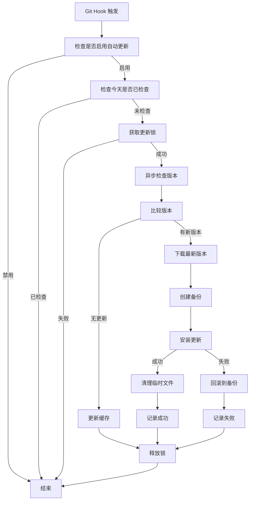

# CodeRocket 自动更新功能指南

## 🚀 功能概述

CodeRocket 现在支持智能的自动版本检查和升级机制，确保您始终使用最新版本的工具，享受最新功能和安全修复。

## ✨ 核心特性

### 1. 智能版本检查
- **每天首次使用时自动触发**：避免频繁的网络请求
- **本地缓存机制**：记录上次检查时间，避免重复检查
- **多源版本获取**：GitHub Releases API → Git Tags → 模拟版本
- **网络超时保护**：5秒超时，失败时静默跳过

### 2. 静默升级机制
- **后台下载安装**：不阻塞主命令执行
- **原子性替换**：确保安装过程的完整性
- **自动备份回滚**：升级失败时自动恢复
- **权限智能处理**：根据安装模式自动适配

### 3. 用户体验优化
- **完全透明**：升级过程对用户无感知
- **成功提示**：升级完成后显示简短通知
- **可配置选项**：用户可自由控制更新行为
- **错误容错**：网络或权限问题不影响主功能

## 🔧 配置选项

### 环境变量配置

在 `.env` 文件中添加以下配置：

```bash
# 启用自动更新（默认: true）
AUTO_UPDATE_ENABLED=true

# 更新检查间隔（默认: daily）
# 支持的值：daily（每天）, weekly（每周）, never（从不）
UPDATE_CHECK_INTERVAL=daily

# 更新渠道（默认: stable）
# 支持的值：stable（稳定版）, beta（测试版）
UPDATE_CHANNEL=stable
```

### 交互式配置

使用命令行工具进行配置：

```bash
# 配置自动更新选项
coderocket auto-update

# 或者使用 AI 配置工具
./lib/ai-config.sh update

# 显示更新状态
coderocket update-status

# 手动检查更新
coderocket update
```

## 📋 使用指南

### 基本使用

自动更新功能默认启用，无需额外配置。每天首次使用 CodeRocket 时会自动检查更新：

```bash
# 正常使用，会自动触发版本检查
git commit -m "feat: 新功能"

# 或者使用任何 coderocket 命令
coderocket setup
```

### 手动操作

```bash
# 手动检查并安装更新
coderocket update

# 查看更新状态
coderocket update-status

# 配置自动更新选项
coderocket auto-update

# 启用自动更新
./lib/auto-updater.sh enable

# 禁用自动更新
./lib/auto-updater.sh disable

# 清理更新缓存
./lib/auto-updater.sh clean
```

### 高级配置

```bash
# 查看详细更新状态
./lib/auto-updater.sh status

# 交互式配置
./lib/auto-updater.sh configure

# 查看帮助信息
./lib/auto-updater.sh help
```

## 🏗️ 技术架构

### 核心模块

1. **lib/auto-updater.sh** - 主要的自动更新模块
   - 版本检查和比较
   - 下载和安装逻辑
   - 备份和回滚机制
   - 缓存和锁管理

2. **lib/version-compare.sh** - 版本比较工具
   - 语义化版本比较
   - 版本格式验证
   - 预发布版本处理

3. **配置集成** - 与现有配置系统无缝集成
   - lib/ai-config.sh 扩展
   - .env.example 更新
   - install.sh 命令集成

### 工作流程



### 安全机制

1. **文件锁机制**：防止并发更新冲突
2. **备份系统**：更新前自动备份当前版本
3. **原子操作**：确保安装过程的完整性
4. **权限检查**：根据安装模式适配权限要求
5. **网络超时**：避免长时间等待网络响应

## 🔍 故障排除

### 常见问题

**Q1: 自动更新不工作**
```bash
# 检查配置
./lib/auto-updater.sh status

# 检查是否启用
./lib/ai-config.sh get AUTO_UPDATE_ENABLED

# 手动测试
./lib/auto-updater.sh check
```

**Q2: 更新失败**
```bash
# 查看日志
cat ~/.coderocket/update.log

# 清理缓存重试
./lib/auto-updater.sh clean
./lib/auto-updater.sh check
```

**Q3: 权限问题**
```bash
# 检查安装目录权限
ls -la ~/.coderocket/

# 全局安装权限问题
sudo ./lib/auto-updater.sh check
```

**Q4: 网络连接问题**
```bash
# 测试网络连接
curl -s https://api.github.com/repos/im47cn/coderocket-cli/releases/latest

# 使用代理
export HTTP_PROXY=http://proxy.example.com:8080
./lib/auto-updater.sh check
```

### 调试模式

启用详细日志输出：

```bash
# 设置调试环境变量
export DEBUG=true

# 运行更新检查
./lib/auto-updater.sh check

# 查看详细日志
tail -f ~/.coderocket/update.log
```

## 📊 监控和日志

### 日志文件

- **更新日志**: `~/.coderocket/update.log`
- **缓存文件**: `~/.coderocket/update_cache`
- **锁文件**: `~/.coderocket/update.lock`
- **备份目录**: `~/.coderocket/backup/`

### 日志格式

```
[2025-07-21 10:52:13] [INFO] 开始检查更新
[2025-07-21 10:52:14] [INFO] 检查更新: 当前版本=1.0.1, 最新版本=1.0.2
[2025-07-21 10:52:14] [INFO] 发现新版本: 1.0.2
[2025-07-21 10:52:15] [INFO] 下载版本 1.0.2 到 /tmp/coderocket-update-12345
[2025-07-21 10:52:16] [INFO] 创建备份: backup-20250721-105216
[2025-07-21 10:52:17] [INFO] 安装更新到: /Users/user/.coderocket
[2025-07-21 10:52:18] [INFO] 静默更新成功: 1.0.2
```

## 🚀 最佳实践

1. **保持默认配置**：推荐使用默认的自动更新设置
2. **定期检查日志**：关注更新日志以了解更新状态
3. **网络环境配置**：在企业环境中配置代理设置
4. **备份重要配置**：更新前确保重要配置已备份
5. **测试新版本**：在生产环境使用前测试新版本功能

## 🔮 未来规划

- [ ] 增量更新支持
- [ ] 更新回滚历史管理
- [ ] 更新通知推送
- [ ] 企业版本管理
- [ ] 自定义更新源支持

---

## 📞 技术支持

如果您在使用自动更新功能时遇到问题，请：

1. 查看本文档的故障排除部分
2. 检查更新日志文件
3. 在 GitHub 仓库提交 Issue
4. 联系技术支持团队

**注意**：自动更新功能设计为静默和安全的，如果遇到任何问题，可以随时禁用自动更新并手动管理版本。
